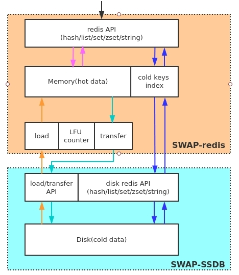

## swapdb

A redis compatiable storage which support data exchange between memory and disk, so you can save a lot of memory cost by using swapdb compared to redis. the main thought of swapdb is, keep hot keys in redis and cold keys in disk, when a key in disk becomes hot, will load it to redis, when a key in memory becomes cold, will transfter it to disk. by using swapdb, you can have both a high preformance cache and high capacity KV storage.

## Fundamental



## Features

* Heat statistics of keys(LFU)
* Configurable threshold of RAM/FLASH capacity
* Redis API compatiable(99%). supports data structures such as strings, hashes, lists, sets, sorted sets
* Cluster management(redis cluster)
* Multiple replica nodes and data replication support(RDB+Snapshot)
* Data persistency support
* High performance and high capacity redis-like storage

## Compile

### requirements:  
```
Cmake >= 2.8.11
GCC >= 4.8
```

### Get the source code
```
git clone https://github.com/JRHZRD/swapdb.git --recursive
```

## Let's build

(you can skip this step if you add '--recursive' option when 'git clone'.) for submodules update process.
```
git submodule update --init --recursive
```

```
cmake . && make -j8
```

## Quick start

you can quickly start a swap-redis and swap-ssdb instance like this:
```
cd utils
# this will use the default "6379" port for swap-redis and "26379" port for swap-ssdb.
./deploy_redis.sh
# or you can specify a specific port like this, for example, use "6380" port
# ./deploy_redis.sh 6380

redis-cli -p 6379
127.0.0.1:6379> set a b
OK
127.0.0.1:6379> locatekey a
"redis"
127.0.0.1:6379> storetossdb a
OK
127.0.0.1:6379> locatekey a
"ssdb"
127.0.0.1:6379> get a
"b"
127.0.0.1:6379> dumpfromssdb a
OK
127.0.0.1:6379> locatekey a
"redis"
```

## Applicable scenes

* cache

swapdb support LFU based heat statistics, hot keys are kept in redis，so you can use swapdb as cache, which has the same performance as redis when access hot keys.

* High capacity redis-like KV storage

By configuring a low threshold of RAM/FLASH capacity, most of the data will be stored in disk and only the hottest data stored in redis.
